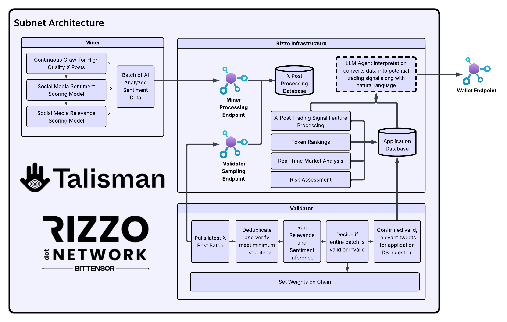

# Talisman AI 🪬 The Perception Subnet for On-Chain Trading Insights  

## 🪬 Vision (Why this subnet exists)

We are building an AI financial reasoning agent that:

- Watches what’s happening across the crypto world - markets, chain activity, and social sentiment
- Spots meaningful signals as they are happening
- Explains what’s happening in plain language
- Converts insights into recommended trading or staking actions
- Surfaces those decisions directly to your Talisman wallets

The subnet doesn’t “decide” what to trade, it feeds the agent with validated, high-quality signal data.

Think of it as your AI assistant for crypto decisions. To achieve this, the system needs situational awareness across multiple data streams.

That awareness starts with SN45, which serves as the eyes and ears of the agent.

| Layer      | What it does                                 | Delivered by       |
|------------|----------------------------------------------|--------------------|
| Perception | Collect signals (markets, chains, sentiment) | SN45               |
| Reasoning  | Analyze signals, generate insights           | Talisman Agent     |
| Action     | Recommend / execute trading or staking       | Wallet Integration |



---

## Phase Roadmap

| Phase              | Data Source             | Goal |
|--------------------|--------------------------|------|
| ✅ Phase 1 (current) | Social media sentiment  | Identify conversations affecting Bittensor ecosystem, starting with X |
| 🔜 Phase 2          | Chain activity + market data | Detect real on-chain money flow + market shifts, subnet tokenomics, and subnet identity changes |
| 🔜 Phase 3          | Agent insights to wallets | Actionable personalized staking/trading suggestions |

---

## 🪬 Overview

For Phase 1, Talisman AI (Subnet 45) continuously analyzes social media for Bittensor-relevant activity, starting with X.

Miners collectively search for high value posts that are relevant to specific subnets; validators verify accuracy and enforce quality.

A coordination API batches submissions and aggregates validator votes, only the high quality submissions are then piped into the wallet - reasoning agent.

---

## 🪬 How It Works

### 🪬 Miner (V3)

- Receives TweetBatch requests from validators over the Bittensor network
- Analyzes each tweet using LLM to determine:
  - Subnet relevance (which subnet the tweet is about)
  - Sentiment (very_bullish, bullish, neutral, bearish, very_bearish)
  - Content type (technical_insight, announcement, etc.)
- Returns enriched tweets with analysis data for validator verification

---

### 🪬 Validation

The validator re-analyzes posts independently.  
If any post fails validation, that miner batch is labeled INVALID and discarded.  
Only if all posts pass does the miner receive VALID and the batch proceeds to the next step in the pipeline.

Checks include:

- Sentiment ±0.05
- Relevance ±0.05
- Score inflation ≤0.05
- Engagement inflation ≤10%
- Timestamp

---

## 🪬 Rewards

**Post score:**

```

post_score = 0.50 × relevance + 0.40 × value + 0.10 × recency

```

**Per-miner quantity modifier:**

```

1–5   posts  → 1.00×
6–20  posts  → 0.95×
21+   posts  → 0.90×

```

**Reward logic:**

| Miner Result | Reward |
|--------------|--------|
| ✅ VALID     | avg_post_score × quantity_modifier |
| ❌ INVALID   | (avg_post_score × quantity_modifier) × 0.1 |

---

## 🪬 Architecture (V3)

```

┌──────────────┐        ┌───────────┐        ┌──────────────┐
│ API Server   │  --->  │ Validator │  --->  │   Miner      │
│ (queue)      │        │           │        │ (analysis)   │
└──────────────┘        └─────┬─────┘        └──────┬───────┘
                               │                     │
                               │  TweetBatch         │
                               │  (with analysis)    │
                               │<────────────────────┘
                               │
                               v
                        ┌──────────────┐
                        │ Set Weights  │
                        │  (on-chain)  │
                        └──────────────┘

```

---

## 🪬 Project Structure

```
talisman_ai_subnet/
├── neurons/                    # Miner and validator nodes
│   ├── miner.py               # Miner entry point
│   ├── validator.py           # Validator entry point
│   └── validator/             # Validator components
└── talisman_ai/               # Core library
    ├── protocol.py            # Bittensor protocol definitions
    ├── config.py              # Configuration
    ├── analyzer/              # Analysis utilities
    ├── validator/             # Validator logic
    └── utils/                 # Utility functions


```

---

## 🪬 Configuration

Before running miners or validators, you need to set up your environment configuration files. Template files are provided that you must rename and fill in with your credentials.

### Miner Configuration (`.miner_env`)

Copy `.miner_env_tmpl` to `.miner_env` and configure the following variables:

| Variable | Description |
|----------|-------------|
| `MODEL` | LLM model identifier for analysis (e.g., `deepseek-ai/DeepSeek-V3-0324`) |
| `API_KEY` | API key for the LLM service |
| `LLM_BASE` | Base URL for the LLM API endpoint |

**Note**: V3 miners do not need X/Twitter API credentials. They receive tweets from validators over the network.

### Validator Configuration (`.vali_env`)

Copy `.vali_env_tmpl` to `.vali_env` and configure the following variables:

| Variable | Description |
|----------|-------------|
| `MODEL` | LLM model identifier for re-analysis (e.g., `deepseek-ai/DeepSeek-V3-0324`) |
| `API_KEY` | API key for the LLM service |
| `LLM_BASE` | Base URL for the LLM API endpoint |
| `X_API_SOURCE ` | Which X api endpoint to use (default: `x_api`) |
| `X_BEARER_TOKEN` | X/Twitter API bearer token for authentication |
| `X_API_BASE` | Base URL for X/Twitter API (default: `https://api.twitter.com/2`) |
| `MINER_API_URL` | URL of the coordination API server (`https://talisman.rizzo.network/api`) |
| `BATCH_HTTP_TIMEOUT` | HTTP timeout in seconds for API requests (default: `30.0`) |
| `VOTE_ENDPOINT` | Endpoint URL for submitting validation votes (`https://talisman.rizzo.network/api/v1/validate_hotkeys`) |
| `BATCH_POLL_SECONDS` | Interval in seconds between polling for new batches to validate (default: `10`) |

---

## 🪬 Running on Mainnet

**Run Miner**


```bash
pip install -r requirements.txt
pip install -e .
cp .miner_env_tmpl .miner_env
# edit .miner_env to include your LLM information (MODEL, API_KEY, LLM_BASE)
.venv/bin/python -m neurons.miner \
  --netuid 45 \
  --wallet.name your_coldkey_here \
  --wallet.hotkey your_hotkey_here \
  --logging.info
```

*Optional: Add `--axon.external_port` and `--axon.external_ip`

**Run Validator**

```bash
pip install -r requirements.txt
pip install -e .
cp .vali_env_tmpl .vali_env
# edit .vali_env to include your LLM information (MODEL, API_KEY, LLM_BASE)
python3 scripts/start_validator.py
    --netuid 45
    --subtensor.network <finney/local/test>
    --neuron.device cuda
    --wallet.name <your wallet> # Must be created using the bittensor-cli
    --wallet.hotkey <your hotkey> # Must be created using the bittensor-cli
    --logging.debug # Run in debug mode, alternatively --logging.trace for trace mode
    --axon.port # VERY IMPORTANT: set the port to be one of the open TCP ports on your machine
```

If you run into a pip error like “packages do not match the hashes…”, it can be caused by a stale pip wheel cache.
Try:

```bash
.venv/bin/python -m pip cache purge
```

---

## 🪬 License

MIT
